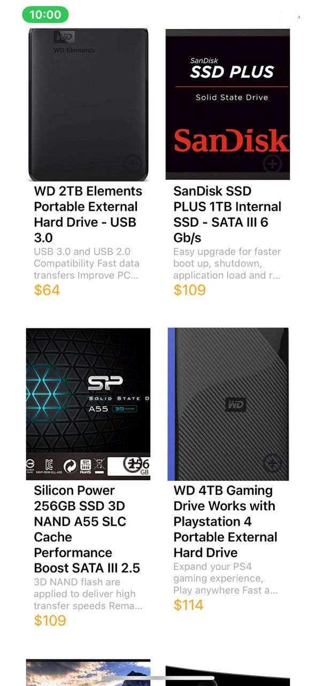
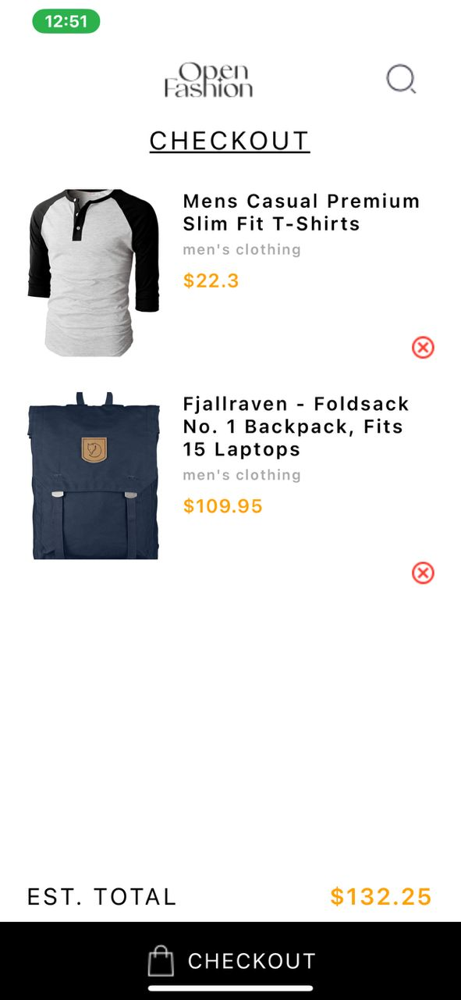
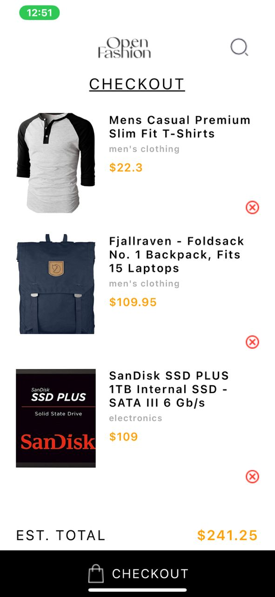
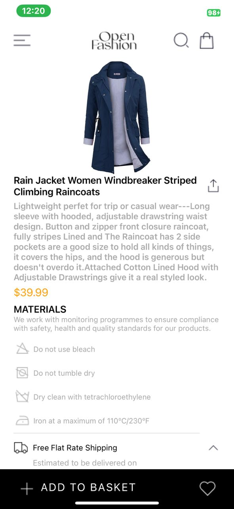
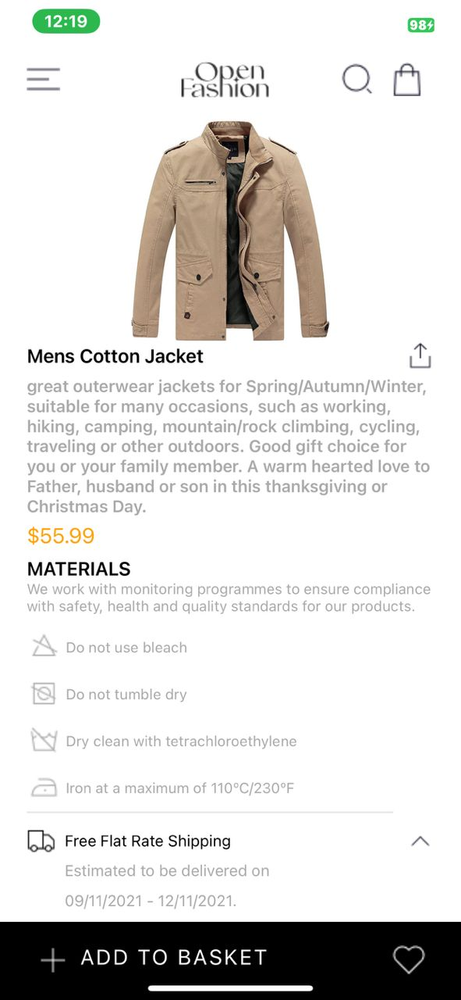
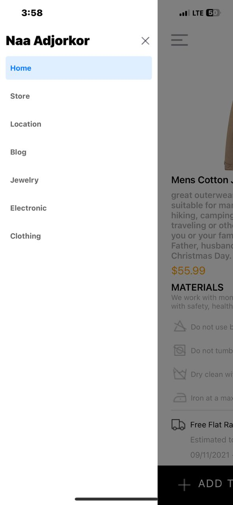
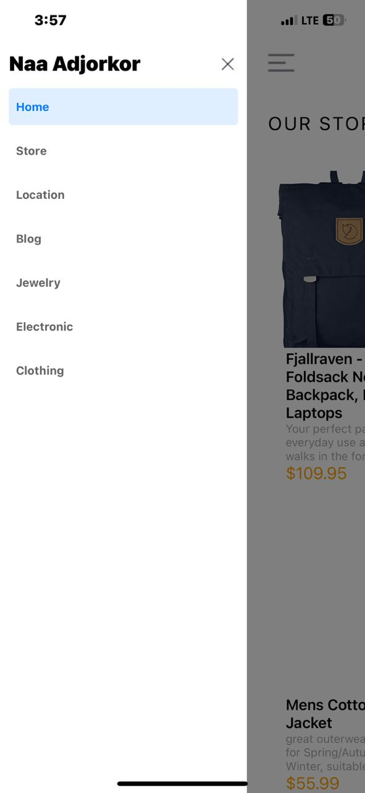

# rn-assignment7-11333063

1. HomeScreen: Displays a list of available products.

2. ProductDetailScreen: Displays detailed information about a product.

3. CartScreen: Displays selected items in the cart.

4. Drawer Navigation: A navigation menu accessible through a swipe gesture or button.

5. Add to Cart: Allows adding products to the cart.

6. Remove from Cart: Allows removing products from the cart.

7. External API Fetching: Fetches data from an external API using fetch or axios.

## State Management
- Context API: Used to manage the global state of the cart, ensuring that cart data is accessible across different screens.

## Data Fetching
- Fetch API: Used to fetch product data from an external API.
- Async/Await: Ensured that asynchronous operations are handled smoothly and data is loaded properly.
- Local Storage
AsyncStorage: Used to store cart data locally on the device, allowing persistence of cart items across app sessions.

## Components
- CartContext.js
- CustomDrawerContent.js
- Products.jsx: Displays individual product details along with an "Add to Cart" button.

## Screens
- HomeScreen.jsx: Fetches and displays a list of products.
- ProductDetailScreen.jsx: Shows detailed information about a selected product.
- CartScreen.jsx: Displays products added to the cart with options to remove them.

### Screenshots

